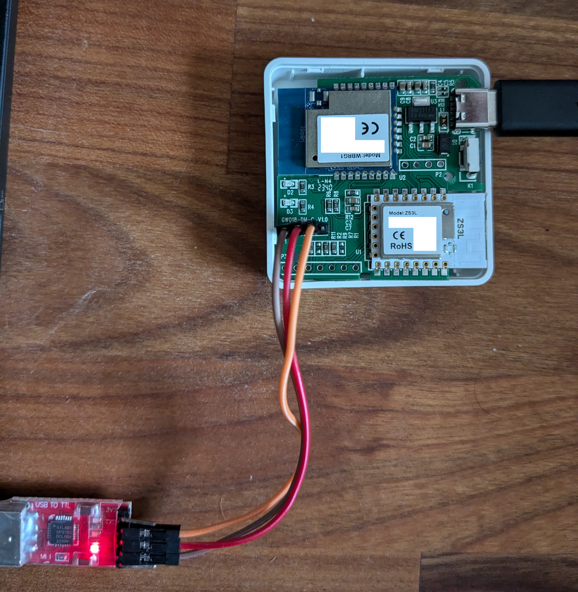
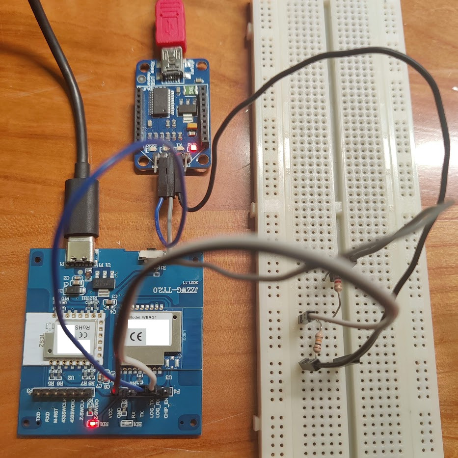
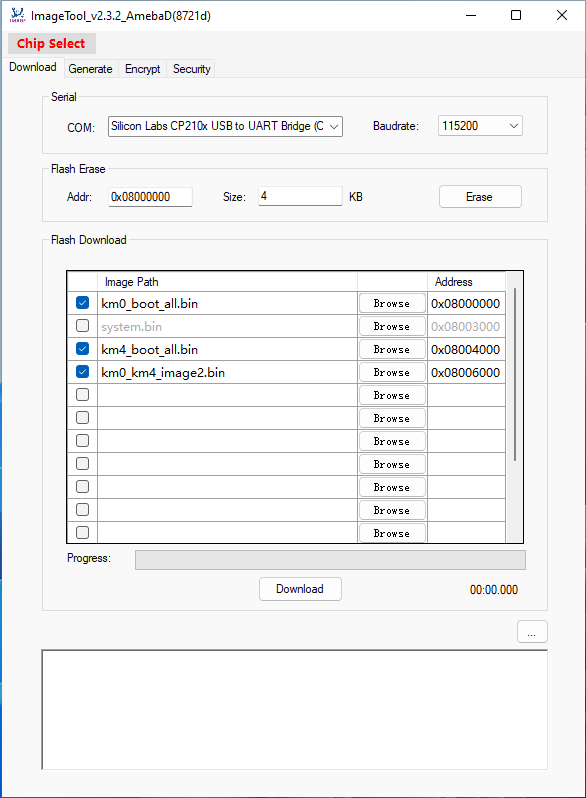

# AmebaD firmware for the Tuya GW018-DM gateway

Replaces both firmwares on a Tuya GW018-DM / RSH-GW018 DM gateway so it works
as a local Zigbee coordinator with no cloud dependency. The WiFi module joins
your network and bridges the Zigbee module's UART to a TCP socket;
Zigbee2MQTT connects to that socket and pairs any standard Zigbee 3.0 device,
regardless of vendor.

**No SWD debugger is required.** The Zigbee module's Gecko bootloader is
unprotected and reachable over the TCP bridge once the WiFi firmware is
running, so its firmware is flashed over the network.

Based on [parasite85/rtl_firmware](https://github.com/parasite85/rtl_firmware),
adapted for AmebaD, on top of
[Seeed-Studio/seeed-ambd-sdk](https://github.com/Seeed-Studio/seeed-ambd-sdk).

**Flashing firmware can leave a device unusable. Make the backup in step 3.**

## Hardware

| Part | Device | Notes |
| --- | --- | --- |
| WiFi / BLE module | WBRG1 = RTL8721CSM | AmebaD, KM4 (Cortex-M33) + KM0 (Cortex-M23), 8 MB flash |
| Zigbee module | ZS3L = EFR32MG21A020F768IM32-B | Same part as a Sonoff ZBDongle-E |
| Zigbee bootloader | Gecko 1.9.2 | Unprotected, accepts XMODEM uploads |
| Stock Zigbee firmware | EmberZNet 6.5.5.0 build 432 | Too old for Zigbee2MQTT; replaced in step 7 |
| Console | 115200 8N1 | Line endings are `\n\r` |

### Board variants

At least two board revisions exist, with the same modules on different
layouts. **Identify yours by the silkscreen printed next to the pins, not by
the connector number** -- both the numbering and the pin order differ.

| | Green board | Blue board |
| --- | --- | --- |
| Silkscreen | `GW018-DM-C -V1.0` | `JZZWG-TY2.0` |
| Console header | `P1` | `P4` |
| Pins, in silkscreen order | `GND` `TX` `RX` `VCC` | `CHIP_EN` `LOG_RX` `LOG_TX` `TX` `RX` `GND` `VCC` |
| Console pins | `TX` / `RX` | `LOG_TX` / `LOG_RX` |
| SWD header | not documented | `P3` |

Headers are unpopulated 2.54 mm through holes on both revisions.

On the **blue board**, the pins labelled plain `TX` and `RX` are a different
WBRG1 UART, not the console. Wiring to them produces no output. Use
`LOG_TX` / `LOG_RX`.

`VCC` on both revisions is the 3.3 V AMS1117 output. Do not feed it.

`CHIP_EN` exists on the blue board only. Leave it unconnected; grounding it
holds the WBRG1 off.

The blue board's `P3` carries, in silkscreen order:

    P3:  Z-SWDIO  Z-SWCLK  433SWDIO  433SWCLK  M-RST  RXD  TXD

All seven are signals -- **there is no GND or VCC on P3**, so take ground
from the console header. P3 is only needed to recover the Zigbee module over
SWD. No 433 MHz module is fitted, so the `433*` pins are unused.

## What you need

* A 3.3 V or 5 V USB-UART adapter that supports 921600 baud
* A 2.54 mm header (4 pins on the green board, 7 on the blue) and a soldering iron
* One 4.7 kOhm and one 10 kOhm resistor, **only if the adapter is 5 V**
* `make`, `python3`, `minicom`, and
  [universal-silabs-flasher](https://github.com/NabuCasa/universal-silabs-flasher)

## 1. Wiring

Solder a header to your board's console connector and connect three wires.
Power the gateway from its own USB-C connector throughout.

| USB-UART adapter | Green board (`P1`) | Blue board (`P4`) |
| --- | --- | --- |
| `GND` | `GND` | `GND` |
| `RXD` | `TX` | `LOG_TX` |
| `TXD` | `RX` | `LOG_RX` |
| `VCC` | leave unconnected | leave unconnected |

A **5 V adapter** needs a divider on the line into the board's console RX
pin. A 3.3 V adapter connects directly.

    adapter TXD ---[ 4k7 ]---+--- console RX      (TX on green, LOG_RX on blue)
                             |
                          [ 10k ]
                             |
                            GND

    adapter RXD ---------------- console TX       (direct, no divider)
    adapter GND ---------------- board GND
    adapter VCC ---------------- not connected

The board's console TX needs no divider in the other direction: 3.3 V clears
an FT232R's 2.0 V input threshold.

| Rule | Reason |
| --- | --- |
| Never connect the adapter's VCC | A 5 V adapter puts 5 V onto the board's 3.3 V rail |
| Never put a resistor to ground on the board's console **TX** pin | A pull-down there makes the chip enter UART download mode on every reset, so the console becomes unreachable |
| Leave `CHIP_EN` unconnected (blue board) | Grounding it holds the WBRG1 off |

*Green `GW018-DM-C -V1.0`, three wires into `P1`, 3.3 V CP2102 adapter.*

*Blue `JZZWG-TY2.0`, three wires into `P4`. The two resistors on the
breadboard are the 4k7 / 10k divider needed for a 5 V adapter.*

## 2. Console access

The console runs at 115200 8N1 on both revisions. To reach the bootloader shell:

1. Start minicom and leave it running: `minicom -b 115200 -D /dev/ttyUSB0`
2. Disable hardware flow control: `Ctrl-A`, `O`, "Serial port setup", `F`,
   Enter, Esc. Skip this and your keystrokes are ignored.
3. Unplug **both** the gateway and the USB adapter.
4. Plug the **gateway** in first, then the **adapter**.
5. Hold ESC. A `#` prompt appears.

Step 3 and 4 are required. Power-cycling the gateway with the adapter already
connected does not reach the prompt, no matter how long ESC is held.

Two quirks of this shell:

* **The first character sent after the prompt appears is discarded.** Send a
  newline before your first command, or `?` is swallowed and you get an empty
  command and a fresh `#` instead of the help text.
* If you script this, do not detect the prompt by searching for `#`. The boot
  output contains the literal text `#example_sw_pta_init success.`. The
  prompt leaves the stream ending in `#` and then idle.

`?` lists the commands: `HELP`, `DW`, `EW`, `FLASH`, `EFUSE`, `REBOOT`.

## 3. Back up the WBRG1 flash

Do this before flashing anything. It is the only way back to stock.

In minicom, start a capture with `Ctrl-A` then `L` and name the file, then:

    flash read 0 2097152

**The length is in 32-bit words, not bytes.** 2097152 * 4 = 8388608, which is
the whole 8 MB chip. Confirm with `flash read 0 64`: it returns 16 lines
covering `00000000` to `000000f0`, i.e. 256 bytes for 64 words.

The dump takes about 40 minutes and produces roughly 27 MB of text ending at
address `007ffff0`. Do not shorten it: the device keys are near the top of the
chip, at `0x7d7000`.

Exit minicom (`Ctrl-A`, `X`), strip everything before the first `00000000:`
line and after the last, then convert:

    awk -F' ' '{print $2$3$4$5}' dump.cap \
      | xxd -r -p | xxd -e | awk -F' ' '{print $2$3$4$5}' \
      | xxd -r -p > wbrg1-stock.bin

The second `xxd` pass swaps the word endianness. Check the result:

| Check | Expected |
| --- | --- |
| File size | 8388608 bytes |
| Data lines in the capture | 524288 |
| First 8 bytes | `99 99 96 96 3f cc 66 fc` (Realtek AmebaD image signature) |

If the first bytes do not match, the endianness conversion did not work and
the file is not a usable backup.

## 4. Build the firmware

On a 64-bit host `make` is the only dependency. The toolchain is not a system
package: `project_hp/toolchain/asdk/` holds split archives that the build
concatenates and unpacks on first use, selecting by `uname -p`. An x86_64 host
gets `asdk-6.4.1-linux-newlib-build-3026-x86_64`, a 64-bit binary running
arm-none-eabi-gcc 6.4.1. No 32-bit libraries are involved.

    sudo apt install make          # or: sudo dnf install make

    git clone --depth 1 --single-branch --branch dev \
      https://github.com/rbeilvert/ambd_sdk_GW018-DM

    cd ambd_sdk_GW018-DM/project/realtek_amebaD_va0_example/GCC-RELEASE
    cd project_lp   && make all    # KM0
    cd ../project_hp && make all    # KM4

Build KM0 first: the two builds write into each other's `asdk/image/`
directories and the KM4 pass assembles the combined image. Each ends with
`========== Image manipulating end ==========`.

The full history is about 1.6 GB, hence `--depth 1`.

Three images are needed for step 5:

| Image | Bytes | From |
| --- | --- | --- |
| `km0_boot_all.bin` | 4144 | `project_lp/asdk/image/` |
| `km4_boot_all.bin` | 4208 | `project_hp/asdk/image/` |
| `km0_km4_image2.bin` | 663552 | `project_hp/asdk/image/` |

`km0_km4_image2.bin` is written to both image directories and the copies are
identical. The KM4 pass prints `size = 663552` and `checksum 3f83757`.

## 5. Flash the WBRG1

Collect four files in one directory:

    km0_boot_all.bin
    km4_boot_all.bin
    km0_km4_image2.bin
    imgtool_flashloader_amebad.bin

The flashloader is **required** and is not shipped with the tool. Copy it from
this repository:

    cp component/soc/realtek/amebad/imgtool_floader/image/imgtool_flashloader_amebad.bin .

Without it the tool prints `Erase flash done!` while doing nothing, preceded
by `error: stat imgtool_flashloader_amebad.bin failed` and
`error: Flashloader download fail`.

Download the Linux CLI
([upload_image_tool_linux](https://github.com/ambiot/ambd_arduino/raw/dev/Arduino_package/ameba_d_tools_linux/upload_image_tool_linux))
into the same directory and `chmod +x` it.

**Use 921600.** At 115200 the tool writes part of the flashloader and then
blocks indefinitely.

**Start the tool immediately after the device enters UART download mode.** In
download mode the module sends NAK bytes (0x15) at about 20/s for a short
while and then drops to about 0.7/s. The tool only synchronises during the
fast phase. If you enter download mode by hand and then take a minute to type
the command, it will hang.

At the `#` prompt, put the module into download mode:

    reboot uartburn

The console prints `#Flash Download Start` followed by a stream of 0x15
bytes. Run the tool at once:

    ./upload_image_tool_linux "$PWD" /dev/ttyUSB0 ameba_rtl8721csm Enable Disable 921600

Scripting the two steps together is the reliable way to do this. A successful
run prints:

    Enter Auto Upload Mode
    Uploading.............................................................
        Upload Image done.
    All images are sent successfully!

Erasing first (`Enable Enable` instead of `Enable Disable`) is optional and
not needed; the flash step writes the regions the images occupy. A full erase
takes far longer than the flash and prints one dot every 500 ms while it runs.

Power-cycle the gateway. The console should show:

    !!!!!!!!!!!!!!!! Hello from KM0 !!!!!!!!!!!!!!!!!!!!!!
    !!!!!!!!!!!!!!!! Hello from KM4 1!!!!!!!!!!!!!!!!!!!!!!
    Initializing WIFI ...
    WIFI initialized
    Example: socket tx/rx 1

`Example: socket tx/rx 1` means the TCP bridge is running.

### Windows GUI alternative

Enter `reboot uartburn` at the prompt, then use
[ImageTool.exe](https://github.com/ambiot/ambd_sdk/raw/dev/tools/AmebaD/Image_Tool/ImageTool.exe)
with .NET Framework 3.5. Chip Select -> AmebaD, baudrate 115200 or 921600.
To erase manually first: 16 KB at `0x08000000`, 8 KB at `0x08004000`,
1224 KB at `0x08006000`.

## 6. Connect to WiFi

At the console prompt. 2.4 GHz only -- the radio has no 5 GHz support.

    ATW0=your-ssid
    ATW1=your-passphrase
    ATWC

The log reports the DHCP address. Give the gateway a static lease; every later
step addresses it by IP. Then:

    reboot

The bridge listens on **TCP port 80**.

## 7. Flash the Zigbee module

Everything here happens over the network. Check the bridge and read the
current radio firmware:

    universal-silabs-flasher --device socket://GATEWAY_IP:80 probe

A stock device reports `EZSP, version '6.5.5.0 build 432'`.

Pick a firmware:

| Firmware | Zigbee2MQTT adapter | Notes |
| --- | --- | --- |
| [EmberZNet 7.4.3](https://github.com/MattWestb/EFR32-FW/issues/6#issuecomment-2347151842) (`G01-pro-ncp-uart-hw.gbl`) | `ember` | Built for the ZS3L. Recommended |
| [EmberZNet 8.0.1.0](https://github.com/MattWestb/EFR32-FW/issues/6#issuecomment-2275368851) | `ember` | Has reported problems when Zigbee2MQTT restarts |
| [EmberZNet 6.5.5.0 stock](https://github.com/MattWestb/EFR32-FW/issues/6#issuecomment-2275368851) | none | Roll back to factory |

All are `ncp-uart-hw` builds, which is why `rtscts` is `true` in step 8.

    universal-silabs-flasher --device socket://GATEWAY_IP:80 \
      flash --firmware G01-pro-ncp-uart-hw.gbl

The upload takes about 75 seconds for a 237 kB image.

**The tool exits non-zero after a successful write.** It reports
`UploadError: None` or `NoFirmwareError: No firmware exists on the device`,
and logs `Failed to read firmware metadata`. Judge the result by the progress
bar reaching 100%, then verify with `probe`. Do not re-flash on the strength
of the exit code alone.

After a write the module stays in the Gecko bootloader. Start the
application by sending `2` to the bootloader menu over the same socket:

    python3 -c "import socket; s=socket.create_connection(('GATEWAY_IP',80)); s.sendall(b'\r\n2')"

Then confirm:

    universal-silabs-flasher --device socket://GATEWAY_IP:80 probe
    # Detected ApplicationType.EZSP, version '7.4.3.0 build 0'

## 8. Zigbee2MQTT

    serial:
      port: tcp://GATEWAY_IP:80
      adapter: ember
      baudrate: 115200
      rtscts: true

Use `adapter: ember` with EmberZNet 7.4.x and newer. `adapter: ezsp` is
deprecated and only works with 7.3 and older, so it cannot be used with the
firmware above.

The first connection often times out. Restart Zigbee2MQTT until it connects.

## Operating notes

**The Zigbee module returns to its bootloader after every WBRG1 reboot.** The
WBRG1 drives the module's boot-select pin, logged at boot as
`zigbee_boot_pin(TY_GPIOB4) init output high`. After a gateway reboot or power
cut, `probe` reports `GECKO_BOOTLOADER, version '1.9.2'` instead of EZSP, and
Zigbee2MQTT cannot connect until the application is started with the `2`
command from step 7. Unattended operation needs this fixed in the firmware.

**Port 80 is hardcoded** in the bridge, so the device cannot also serve HTTP.

**Reflashing the Zigbee module ends its Bluetooth mesh function.** One radio,
one firmware.

**A Zigbee coordinator over WiFi is less reliable than a wired one.**
Zigbee2MQTT documents this; EZSP does not tolerate packet loss or latency
jitter well. Keep the gateway within good range of the access point.

## Updating over the air

Both modules can be updated without opening the case again.

WBRG1: set `HOST` in
`component/common/example/ota_http/example_ota_http.c` to your machine,
rebuild, serve the image directory, then hold the gateway's reset button for
3-4 seconds once the blue LED settles. It downloads `OTA_All.bin` itself.

    cd project_hp/asdk/image && python3 -m http.server 8080

The OTA example can be disabled by setting `CONFIG_EXAMPLE_OTA_HTTP` to `0`
in `project/realtek_amebaD_va0_example/inc/inc_hp/platform_opts.h`.

Zigbee module: as in step 7, over `socket://GATEWAY_IP:80`.

## Recovery

**WBRG1 unbootable.** Reach the console again (`P1` green / `P4` blue) and
flash from step 5.
The bootloader lives in a region ImageTool does not erase. Restore the stock
image from your step 3 backup if needed.

**Zigbee module unbootable.** Flash the stock 6.5.5.0 GBL over the bridge. If
the bridge is unavailable, use SWD on the blue board's `P3`: `Z-SWDIO`,
`Z-SWCLK`, `M-RST`, with ground from the console header.

## Known issues

* The Zigbee module needs its application started manually after every host
  reboot (see Operating notes).
* The TCP bridge port is not configurable.
* Zigbee2MQTT's first connection attempt after startup usually fails.
* `universal-silabs-flasher` reports an error after writes that succeeded.

## Credits

* [jasperw1996/ambd_sdk_GW018-DM](https://github.com/jasperw1996/ambd_sdk_GW018-DM) -- the GW018-DM port this is forked from
* [parasite85/rtl_firmware](https://github.com/parasite85/rtl_firmware) -- original concept
* [Seeed-Studio/seeed-ambd-sdk](https://github.com/Seeed-Studio/seeed-ambd-sdk) -- base SDK
* [ambiot/ambd_arduino](https://github.com/ambiot/ambd_arduino) -- ImageTool
* [NabuCasa/universal-silabs-flasher](https://github.com/NabuCasa/universal-silabs-flasher)
* [MattWestb/EFR32-FW issue #6](https://github.com/MattWestb/EFR32-FW/issues/6) -- hardware analysis and the ZS3L firmware images
* [pvvx RSH-GW018](https://pvvx.github.io/RSH-GW018_DM/) -- pinouts and stock flash images
